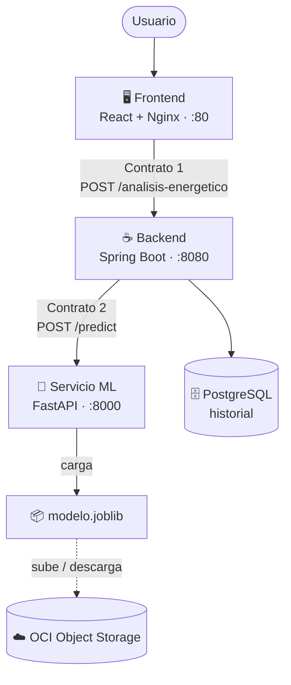

<div align="center">

# ⚡ EnergiAI

### Inteligencia artificial para entender, clasificar y optimizar tu consumo eléctrico

[]()
[]()
[]()
[]()
[]()
[]()
[]()

**Demo en vivo:** http://159.54.157.211

</div>

---

## 💡 ¿Qué es EnergiAI?

Muchas personas reciben facturas de electricidad elevadas sin entender realmente qué
hábitos de consumo las provocan. **EnergiAI** analiza los datos de consumo eléctrico
de una vivienda o pequeño establecimiento y responde tres preguntas clave:

- **¿Qué tan eficiente es mi consumo?** — clasificación automática en *Eficiente*, *Moderado* o *Ineficiente*, con un modelo de Machine Learning entrenado sobre patrones reales de uso.
- **¿Qué puedo hacer para mejorarlo?** — recomendaciones concretas y personalizadas según los hábitos detectados.
- **¿Cuánto me está costando?** — una estimación clara del gasto mensual asociado.

El objetivo es transformar datos crudos de consumo en información simple y accionable
que ayude a tomar mejores decisiones sobre el uso de la energía en el hogar o en el
negocio.

---

## ✨ Funcionalidades

- 🔍 **Clasificación de perfil energético** mediante un modelo de Machine Learning (Random Forest / Regresión Logística) entrenado con datos de consumo residencial.
- 💬 **Recomendaciones personalizadas** de ahorro, generadas según los hábitos específicos detectados en cada análisis.
- 💰 **Estimación de costo mensual**, calculada sobre una tarifa de referencia.
- 📊 **Historial de análisis**, para hacer seguimiento de la evolución del consumo a lo largo del tiempo.
- 🧪 **Comparador de escenarios** — contrasta un perfil de referencia con cambios hipotéticos, mostrando ahorro o sobrecosto sin guardar las simulaciones en el historial.
- 📖 **API documentada** y lista para integrarse con otras aplicaciones o sistemas.

---

## 🖼️ Vista previa

> _Capturas de la interfaz disponibles próximamente._

---

## 🧱 Arquitectura

EnergiAI está compuesto por cuatro servicios independientes que trabajan en conjunto,
orquestados con Docker Compose y desplegados sobre **Oracle Cloud Infrastructure (OCI)**:



- **Interfaz web** — formulario de ingreso de datos, visualización de resultados y simulador interactivo.
- **API REST** — valida la información recibida, orquesta el análisis y calcula el costo estimado.
- **Servicio de predicción** — ejecuta el modelo de Machine Learning entrenado y devuelve la clasificación.
- **Infraestructura en la nube (OCI)** — aloja la aplicación con disponibilidad continua y almacena el modelo entrenado.

Los servicios se comunican por la red interna de Docker; solo el frontend (puerto 80) se
expone al exterior.

---

## 🛠️ Tecnologías utilizadas

| Área | Tecnología |
|---|---|
| Ciencia de datos | Python, Pandas, Scikit-Learn |
| Servicio de predicción | FastAPI |
| API principal | Java 21, Spring Boot 4 |
| Base de datos | PostgreSQL |
| Interfaz web | React, Vite, TailwindCSS |
| Infraestructura | Docker, Oracle Cloud Infrastructure (Object Storage + Compute) |

---

## 🚀 Cómo probarlo localmente

Se requiere tener **Docker** y **Docker Compose** instalados.

```bash
git clone https://github.com/No-Country-simulation/G9-LATAM-Team-36.git
cd G9-LATAM-Team-36
cp .env.example .env          # opcional: hay valores por defecto
docker compose up -d --build
```

Esto levanta los 4 servicios. En local, el `modelo.joblib` entrenado se monta por volumen
en el servicio ML (no requiere OCI). Para verificar que todo quedó sano:

```bash
bash infra/scripts/check.sh
```

Una vez levantado:

| Servicio | URL |
|---|---|
| Interfaz web | http://localhost |
| Documentación del servicio de predicción | http://localhost:8000/docs |
| Documentación de la API (Swagger) | http://localhost:8080/swagger-ui.html _(próximamente — Bloque F)_ |

Para apagar: `docker compose down` (agregar `-v` para borrar también la base de datos).

---

## 📡 Ejemplo de uso de la API

**Solicitud** — `POST /analisis-energetico`

```json
{
  "consumo_kwh": 420,
  "uso_horario_pico": true,
  "cantidad_equipos": 10,
  "tipo_inmueble": "Casa",
  "horas_alto_consumo": 8
}
```

**Respuesta**

```json
{
  "categoria": "Ineficiente",
  "probabilidad": 0.81,
  "recomendaciones": [
    "Reducir el uso de equipos durante horarios pico",
    "Evaluar aparatos con alto consumo energético",
    "Distribuir actividades de mayor consumo a lo largo del día"
  ],
  "costo_estimado_mensual": 315.00
}
```

La documentación interactiva completa estará disponible en `/swagger-ui.html` una vez
que el Bloque F la habilite.

---

## ☁️ Despliegue en OCI

El proyecto se despliega sobre **Oracle Cloud Infrastructure** usando dos servicios:
**Object Storage** (almacena el modelo entrenado) y **Compute** (aloja los 4 contenedores).

La guía paso a paso —crear el bucket, la VM, la red y desplegar— está en
[`infra/oci/notas.md`](infra/oci/notas.md). En la VM, el despliegue es un solo comando:

```bash
bash infra/scripts/deploy.sh   # trae cambios, reconstruye, levanta y verifica
```

---

## 📂 Estructura del repositorio

```
├── data-science/   Exploración de datos, entrenamiento y evaluación del modelo
├── ml-service/     Servicio de predicción (FastAPI)
├── backend/        API REST (Spring Boot)
├── frontend/       Interfaz web (React)
└── infra/          Configuración de despliegue y de infraestructura en la nube
```

---

## 📍 Estado del proyecto

Este proyecto se encuentra **en desarrollo activo** como parte de un programa de
formación práctica en tecnología (Hackathon ONE, en colaboración con Alura y
Oracle). Las funcionalidades descritas en este documento reflejan el alcance
planeado del producto mínimo viable.

---

## 📄 Licencia

Este proyecto se distribuye bajo la licencia MIT. Ver el archivo `LICENSE` para más
información.

---

<div align="center">

**EnergiAI** — Transformando datos de consumo en decisiones más conscientes.

</div>
